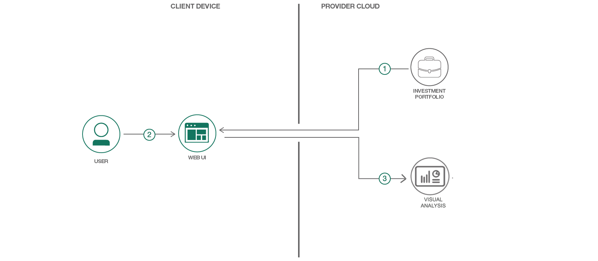
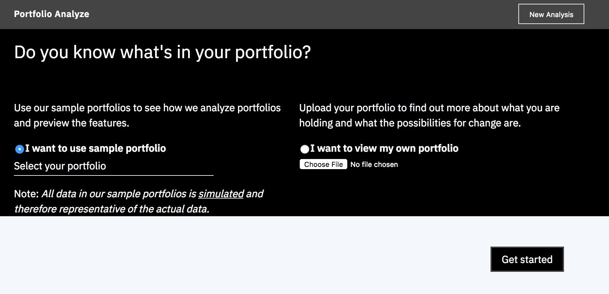
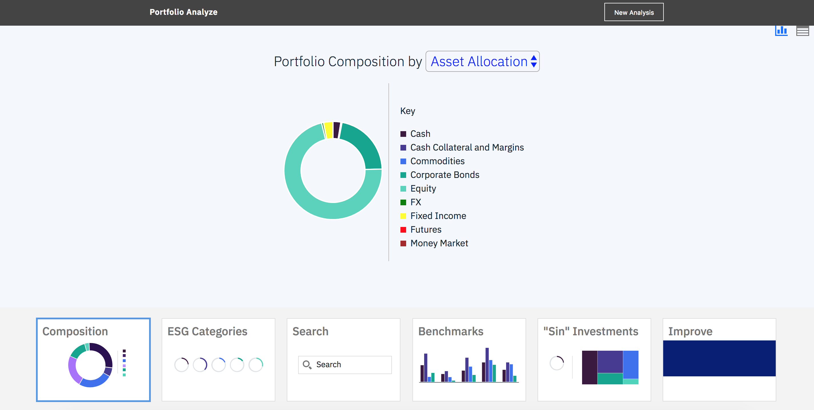
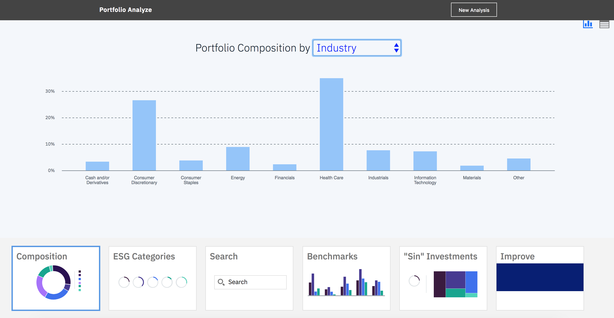
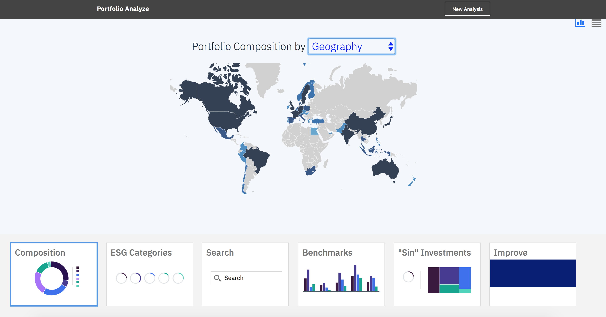
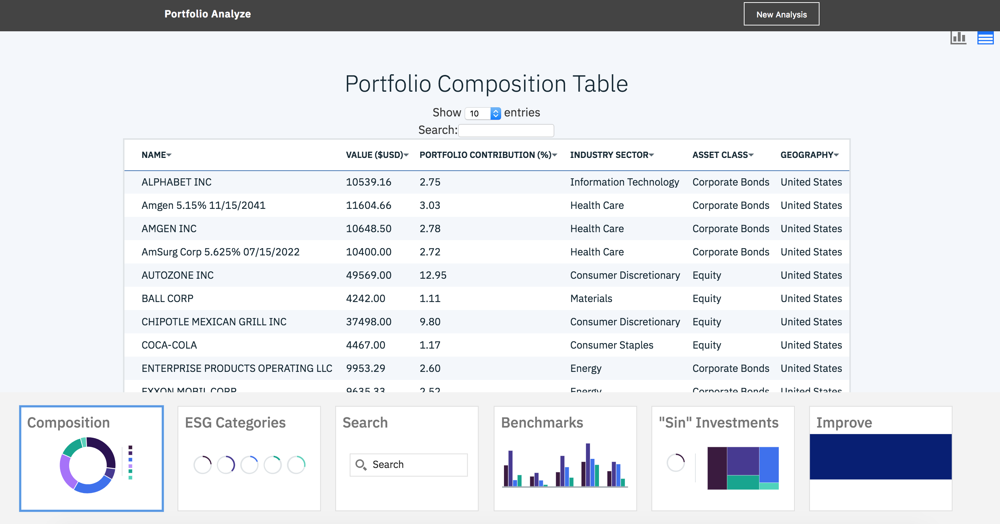
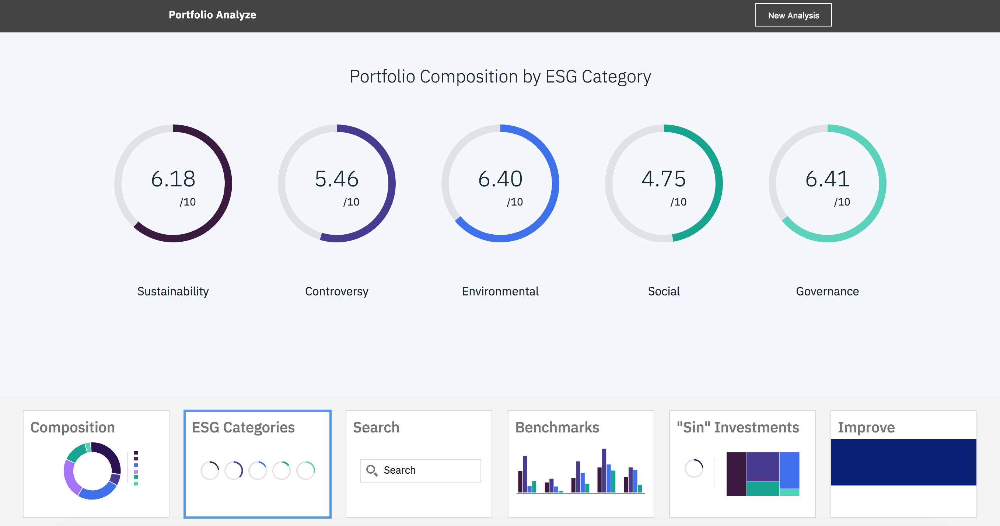
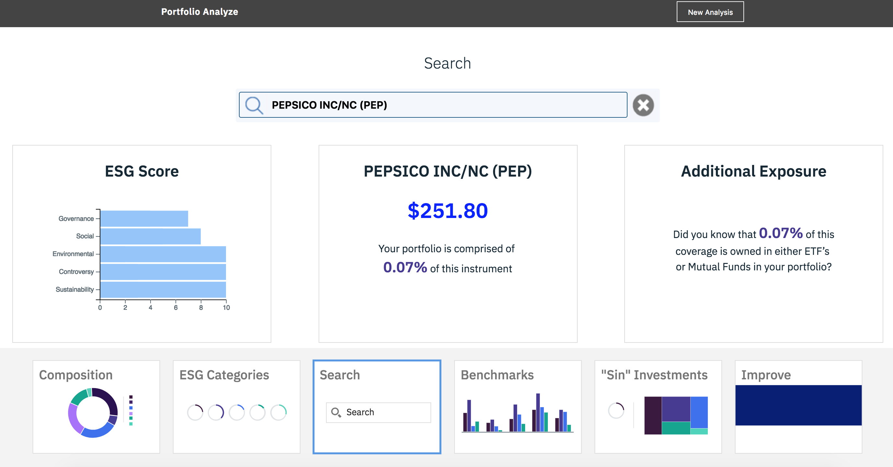
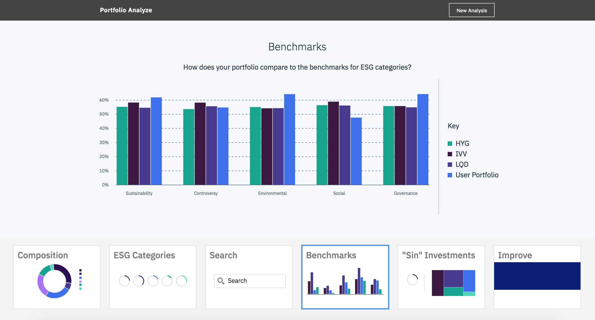
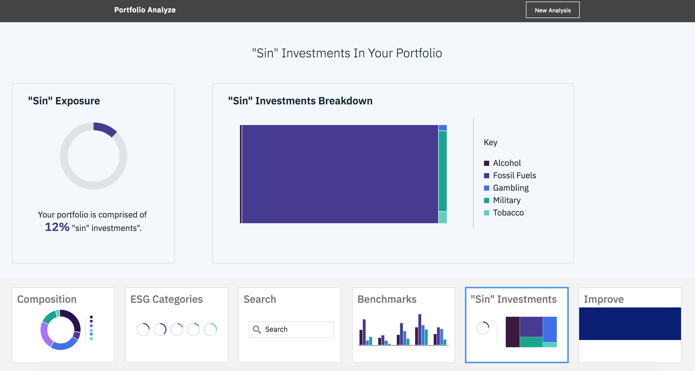

[](https://travis-ci.org/IBM/Analyze-Investment-Portfolio)


# Portfolio Analyzer

## Understanding true exposures and properties by looking through funds

- The **Investment Portfolio service** is used to manage and store portfolios and financial security information such as the set of eligible investments, benchmarks, and user portfolios.

This code pattern is designed for developers with interest in creating financial applications pertaining to investment portfolios and understanding the true underlying exposures that are often obscured when investing in composite investment securities such as ETFs and Mutual Funds  When the reader has completed this journey, they will understand how to:

* Load and retrieve data from the Investment Portfolio service
* Computes all of the exposures associated with a portfolio that may have composite investments present
* Construct a user interface with D3 graphics to display analysis



# Flow

1. User uploads a portfolio for analysis.
2. User selects a portfolio to analyze.
3. The code pattern queries the user's portfolio, any look-through information on funds held in the user portfolio, and calculates all of the analytics necessary to populate the GUI.

## Included Components
+ [Investment Portfolio](https://console.ng.bluemix.net/catalog/services/investment-portfolio) The Investment Portfolio service lets you store, update, and query your investment portfolios and associated holdings using flexible object definitions
> The Investment Portfolio service is available for free on [IBM Cloud](https://console.bluemix.net)

## Featured Technology

* [Python](https://www.python.org/downloads/) Python is a programming language that lets you work more quickly and integrate your systems more effectively.
* [JQuery](https://jquery.com): jQuery is a cross-platform JavaScript library designed to simplify the client-side
scripting of HTML.
* [D3.js](https://d3js.org/): D3 is a JavaScript library for visualizing data with HTML, SVG, and CSS.
* [Carbon Design System](http://www.carbondesignsystem.com/): Carbon is the design system for IBM Cloud products with a series of individual styles, components, and guidelines used for creating unified UI.


## Prerequisite

- [IBM Cloud account](https://console.bluemix.net/registration/?target=%2Fdashboard%2Fapps)


# Steps

Use the ``Deploy to IBM Cloud`` button **OR** create the services and run ``Run Locally``.

# Deploy to IBM Cloud

Create an [IBM Cloud account](https://console.bluemix.net/registration/?target=%2Fdashboard%2Fapps) and directly deploy the application using the button below.

[](https://bluemix.net/deploy?repository=https://github.com/IBM/Analyze-Investment-Portfolio)


# Running the Application Locally
Follow these steps to setup and run this developer journey. The steps are described in detail below.

## Prerequisite
- [Python](https://www.python.org/downloads/)

## Steps to run locally
1. [Clone the repo](#1-clone-the-repo)
2. [Create Investment Portfolio service](#2-create-investment-portfolio-service)
3. [Configure .env file](#4-configure-env-file)
4. [Run Application](#5-run-application)
5. [Upload Holdings](#6-uploading-holdings)
6. [Analyze Portfolio](#7-analyze-portfolio)
7. [Deploy to IBM Cloud](#7-deploy-to-ibm-cloud)

## 1. Clone the repo

Clone the `Analyze Investment Portfolio code` locally. In a terminal, run:

  `$ git clone https://github.com/IBM/Analyze-Investment-Portfolio.git`

## 2. Create Investment Portfolio service

Create the following services in IBM Cloud. This services is part of `Free` plan.

* [**Investment Portfolio**](https://console.ng.bluemix.net/catalog/services/investment-portfolio)


## 3. Configure .env file

Create a `.env` file in the root directory of your clone of the project repository by copying the sample `.env.example` file using the following command in terminal:

  ```none
  cp .env.example .env
  ```

> Most files systems regard files with a "." at the front as hidden files.  If you are on a Windows system, you should be able to use either [GitBash](https://git-for-windows.github.io/) or [Xcopy](https://docs.microsoft.com/en-us/windows-server/administration/windows-commands/xcopy)

You will need to update the credentials with the IBM Cloud credentials for the services you created in [Step 2](#2-create-investment-portfolio-service).

The `.env` file will look something like the following:

```none
# Investment Portfolio
CRED_PORTFOLIO_USERID_W=
CRED_PORTFOLIO_PWD_W=
CRED_PORTFOLIO_USERID_R=
CRED_PORTFOLIO_PWD_R=

```

## 4. Run Application

In your terminal, cd into this project's root directory
+ Run `pip install -r requirements.txt` to install the app's dependencies
+ Run `python run.py`
+ Access the running app in a browser at <http://0.0.0.0:8080/>



## 5. Upload Holdings

Once the application is running, the first step is to upload a file that will be used to create a portfolio or a series of portfolios in the Investment Portfolio service. We use the file format of the Algorithmics Risk Service (ARS) import file as many production clients are already used to that format.

- The column labeled "UNIQUE ID" must refer to the unique identifier of the asset in our system.
- The "NAME" column will hold the display name of the asset.
- "POSITION UNITS" column holds the quantity.
- "PORTFOLIO" indicates which portfolio the asset belongs to.

The code will create a portfolio for each unique element found in the "PORTFOLIO" column. Future releases of this code will take into account a portfolio hierarchy, but currently each portfolio is entirely independent of each other.

Some notes:
- The portfolio will be loaded as 100-asset chunks as there are currently limitations on POST request sizing.
- The portfolio will be tagged as type = 'look through portfolio' to distinguish between any other portfolios that may exist in the system.

*Note: You can navigate to /api/look_through_delete to delete all portfolios that have been loaded into the service using this application. Specifically, it looks for portfolios with "type = look through portfolio". You can always start over this way, but be careful to not access this if you've done considerable work.*

## 6. Analyze Portfolio

The next step is to use the application to call the **/api/portfolio-analyze** endpoint. This will perform the following:
- Read the portfolio that the user selected and determine if any composite securities are included as part of that portfolio.
- Retrieve any additional portfolios associated with composite investments in the user's portfolio. E.g. If a user has invested in the S&P 500 ETF (IVV),
we'll want to retrieve all of the holdings and data associated with IVV.
- Computes the equivalent dollar weight of each security touched by the user's portfolio, and calculate all true exposures looking through to the funds.
- Return a payload of the results
- Pipe results into several visualization and front-end components for the user to observe.

Some notes:
- The/ portfolio-analyze endpoint returns data formatted for the GUI packaged with this code pattern. Additional endpoints are included to make smaller, more custom request types depending on your use case.
- Instruments not found will be ignored.

#### Visualizations

* View portfolio composition by asset allocation



* View portfolio composition by industry



* View portfolio composition by geography



* View portfolio composition table



* View portfolio composition by ESG Category



* Search for a holding in your portfolio and get key information pertaining to it



* Compare your ESG scores with couple benchmarks



* View "sin" invetments in your portfolio




## 7. Deploy to IBM Cloud

Edit the `manifest.yml` file in the folder that contains your code and replace with a unique name for your application. The name that you specify determines the application's URL, such as `your-application-name.mybluemix.net`. Additionally - update the service names so they match what you have in the IBM Cloud. The relevant portion of the `manifest.yml` file looks like the following:

  ```none
  declared-services:
    Investment-Portfolio:
      label: fss-portfolio-service
      plan: fss-portfolio-service-free-plan
  applications:
  - path: .
    memory: 128M
    instances: 1
    name: Portfolio-Analyze
    disk_quota: 1024M
    domain: mybluemix.net
    services:
    - Investment-Portfolio
    buildpack: python_buildpack
  ```

You can push the app to IBM Cloud using [IBM Cloud CLI](https://console.bluemix.net/docs/cli). This will use the services and application name in the `manifest.yml` file.  From your root directory login into IBM Cloud using CLI:
```
bx login
```
And push the app to IBM Cloud:
```
bx push
```

# Troubleshooting

* To troubleshoot your IBM Cloud application, use the logs. To see the logs, run:

```bash
bx logs <application-name> --recent
```

* If you are running locally - inspect your environment variables closely to confirm they match.  Try running each service as standalone:

```bash
python InvestmentPortfolio.py
```

# Learn more
<ul>
<li><strong>Finance Code Patterns</strong>: Enjoyed this Code Pattern? Check out our other <a href="https://developer.ibm.com/code/industries/finance/" rel="nofollow">Finance Code Patterns</a>.</li>
<li><strong>Data Analytics Code Patterns</strong>: Enjoyed this Code Pattern? Check out our other <a href="https://developer.ibm.com/code/technologies/data-science/" rel="nofollow">Data Analytics Code Patterns</a></li>
</ul>

# License

[Apache 2.0](LICENSE)
